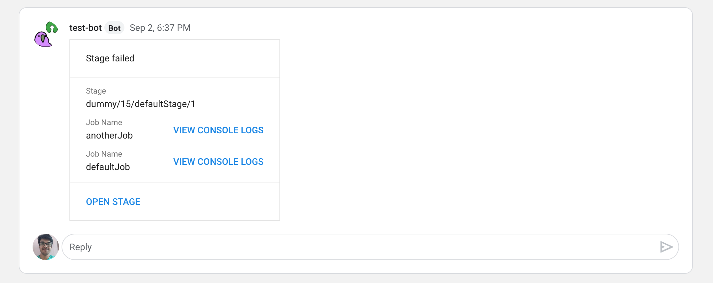

# Docs

## Plugin Code Walkthrough

The plugin currently has the following features:
* The user can set Google Chat Webhook URL through the plugin configuration
* Send notifications when a build fails - particularly a stage in a build
pipeline

This is how the plugin works:
* The plugin identifies itself as a `notification` plugin to the GoCD server
through the plugin identifier method `pluginIdentifier()`. This tells GoCD
server to send some notifications to the plugin when a pipeline stage's state
changes
* It handles all the requests from the GoCD server using the `handle` method
* It can handle multiple kinds of requests, and when the request kind is
unknown, it just doesn't process it which usually means that it's not
concerned about that kind of request and hence still gives the server
succesful response to show that there was no error in processing or
understanding the request. It just chooses which requests to process and which
not to.
* It notifies / responds to the GoCD server about the kinds of notifications
it's interested in using the `handleNotificationsInterestedIn` handler method
* It has a handler method to give the plugin view template to the GoCD server -
`handlePluginSettingsGetView`. The template is a Angular JS based view template.
* It has a handler method `handlePluginSettingsGetConfiguration` to give data
to the GoCD server related to the plugin configuration view
* It has a handler method `handlePluginSettingsValidateConfiguration` to
validate the plugin configuration provided by the user
* It has a handler method `handleStageStatusChanged` to handle changes in
pipeline stages, which is discussed in detail below!

### Pipeline stage status changes

When a pipeline's stage status changes, like when it succeeds or fails,
the GoCD server sends a request to the plugin to notify the plugin about
this status change and the plugin uses the handler method
`handleStageStatusChanged` to handle such requests. This is what the
handler method does

* Parse the request into an object for processing
* Find if the stage has failed
* If the stage has failed, then
    * Find the stage ID
    * Find the stage URL
    * Find the stage console log URLs
    * Build a Google Chat API request JSON body which represents a beautiful
    chat message with action buttons and information
    * Get the webhook URL from the plugin configuration by requesting the
    GoCD server for the plugin configuration
    * Use the webhook URL and the request body to send a request to the
    Google Chat API, to send the beautiful chat message

Demo image:

